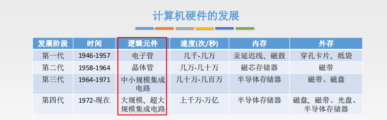
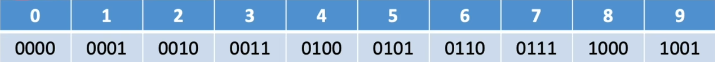
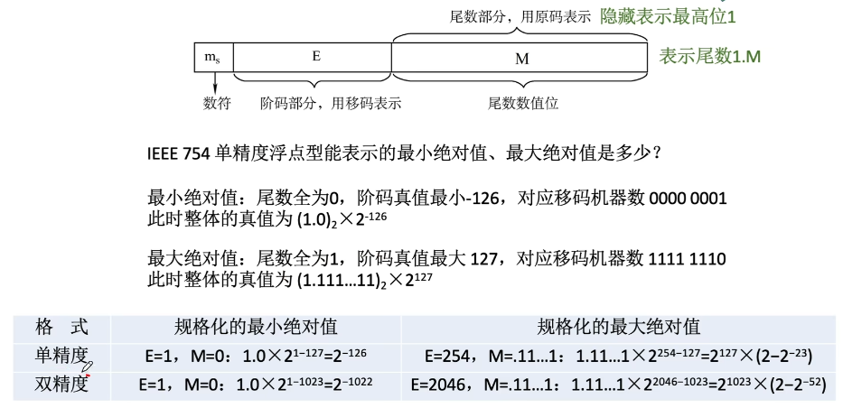
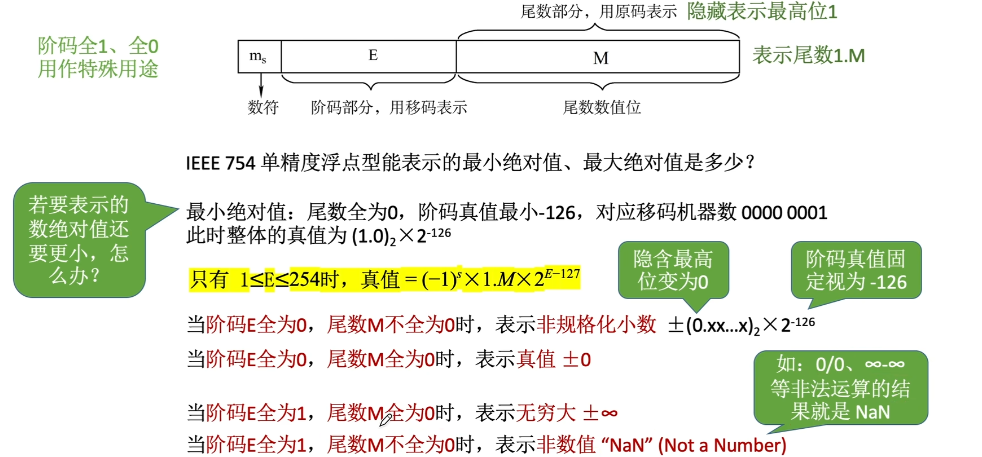

#  计算机系统概述

## 计算机发展历程

1. 计算机系统：硬件 + 软件

2. 硬件的发展

   + 电子管时代
   + 晶体管时代
   + 中小规模集成电路时代
   + 大规模，超大规模集成电路时代

   

3. 软件的发展离不开语言的发展(系统软件，应用软件)
   + 高级语言：fortean,pascal,c++,java

## 计算硬件的基本组成

1. 五大部分
   + 输入设备
   + 输出设备
   + 主存储器
   + 运算器：逻辑运算，算术运算
   + 控制器：指挥各部件，使程序运行
2. 早期冯诺伊曼机
   + “存储程序”的概念

3. 现代计算机的结构

   + CPU＝运算器 + 控制器

   

## 各个硬件的工作原理

1. 主存储器

   

   + 概念
     + 存储单元：每个存储单元存放一串二进制代码、
     + 存储字（word）：存储单元中二进制代码的组组合
     + 存储字长：存储单元中二进制代码的位数
     + 存储元：即存储二进制的电子元件，每个存储元可存1bit
   + MAR(Memory Address Register)：地址寄存器，用于指明要读/写哪个存储单元。其位数反映存储单元数的数量
   + MDR(Memory Data Register)：数据寄存器，用于暂存要读/写的数据。其位数=存储字长

2. 运算器

   

3. 控制器

   

4. 工作过程

## 计算机系统的层次结构

1. 五层

   + M4： 高级语言机器（执行高级语言）：用编译程序翻译成汇编语言程序
   + M3：汇编语言机器（执行汇编语言）：用汇编程序翻译成机器语言程序
   + M2：操作系统机器（向上提供广义指令（系统调用））
   + M1：传统机器（执行机器语言的机器）
   + M0：微程序机器（执行微指令）

   M0，M1属于硬件层面，而其余三层属于软件层面

2. 三个级别的语言

   

## 计算机性能指标

1. 存储器的性能指标

   总容量=存储单元个数 * 存储单元的字长 bit

   ​			=（存储单元个数 * 存储单元的字长）/ 8 Byte

2. CPU的性能指标

   

3. 系统整体的性能指标

   + 数据通路宽度
   + 吞吐量
   + 响应时间
   + 基准程序（跑分软件）

   

# 数据的表示和运算

## 进位技术制

1. 二进制、八进制、十六进制转换为十进制

2. 二进制  <--> 八进制，十六进制

   八进制，十六进制  <--> 二进制 

3. 各种进制的常见书写方式
   + 二进制 1010B
   + 十六进制 1625H      0x1625
   + 十进制   1652D
4. 十进制 -> 任意进制
   + 十进制转换为二进制（拼凑法）

5. 真值和机器数
   + 真值：实际的带正负号的数值
   + 机器数：把正负号数字化的数（存到机器里的样子）

## BCD码

1. 8421码

   + 每4个二进制位对应一个十进制位(有6个冗余状态)
   + 8，4，2，1分别对应每一位的权值
   + 0000~1001分别对应0~9进行加法后若超出该范围，则需要 + 0110修正（强制高位进一）

   

2. 余3码

3. 2421码

   2，4，2分别对应每一位的权值

   表示0~4最高位表示0，表示5~9时最高位为1

## 无符号整数表示和运算

1. 无符号整数的表示（在计算机内）
   + 全部二进制位都是数值位，没有符号位，第i位的位权是2的i-1次方
   + nbit 无符号整型表示范围 0 ~ 2的n次方减一
2. 无符号整型的加法

​          从最低位开始，按位相加，并往高进位

3. 无符号整型的减法
   + “被减数”不变，“减数”全部按位取反、末位+1，减法变加法
   + 从最低位开始，按位相加，并往高进位

## 带符号整数表示和运算（原/反/补）

1. 带符号数补码的加法：从最低位开始，按位相加（符号位参与运算），并往高位进位
2. 带符号数补码的减法：
   + “被减数”不变，“减数”全部按位取反、末位+1，减法变加法
   + 从最低位开始，按位相加，并往高进位 

## 原/反/补特性对比

## 移码

## 定点小数表示和运算 

1. 定点小数的表示

   

2. 运算都和上面带符号整数的运算一样的规则

## 奇偶校验码

1. 校验原理
2. 奇偶校验

3. 异或运算

   1异或0 = 1

   1异或1 = 0

**如果两bit同时出现错误，是检验不出错误的**

## 算术逻辑单元（ALU）

1. ALU：算术逻辑单元

   

   2. 电路基本知识

      + 逻辑运算

        优先级：与  >  非

        

        

        + 门电路：最基本的逻辑元件，用于实现逻辑运算
        
        + 逻辑表达式就是电路的数字化表示。根据逻辑运算的规则对逻辑表达式进行优化
        
          

3. 加法器的实现

   + 一位全加器

     

   + 串行加法器

     

   + 串行进位的并行加法器

## 并行进位加法器

并行进位的并行加法器，各级进位信号同时形成，又称为先行进位，同时进位

## 补码加减运算器

## 标志位的生成

标志位的含义

## 移位运算

1. 算术移位

   + 左移1位相当于×基数，右移一位相当于÷基数

   + 原码：符号位不参与移位。左移、右移都补0

     + 正数、负数都一样：高位补0，低位补0

   + 反码：符号位不参与移位。左移、右移都补1

     + 正数：整数反码的移位运算和原码相同
     + 负数：高位补1，低位补1

   + 补码：

     + 负数：高位补1，低位补0
     + 正数：同原码
     
     

2. 逻辑移位

   + 左移，右移都补0，移出的位舍弃

   + 应用：RGB

3. 循环移位

   + 不带进位位

     用移出的位补上空缺

   + 带进位位

     移出的位放到进位位，原进位位补上空缺

     

   + 应用

     大端存储，小端存储的切换

## 定点数乘法运算

1. 原码一位乘法
   + 符号位通过异或确定，数值位由被乘数和乘数的绝对值进行n轮加法和移位
   + 每次加法可能+0、+[|x|]原
   + 每次移位--逻辑右移
   + 乘数的符号位不参与运算
   + MQ中最低位=1时，ACC+[|x|]原
   + MQ中最低位=0时，ACC+0

2. 补码一位乘法

   + 进行n轮加法、移位，最后在多一次加法

   + 每次加法可能+0，+[x]补，+[-x]补

   + 每次移位是“补码的算数右移”

   + 符号位参与运算

   + 辅助位-MQ中的最低位 = 1 ，（ACC） +  [x]补

     辅助位-MQ中的最低位 = 0 ，（ACC） +  0

     辅助位-MQ中的最低位 = -1 ，（ACC） +  [-x]补

   + **最后多算一次加法**

   

   ## 定点数除法运算

   1. 原码除法：恢复余数法

      

   2. 原码除法：加减交替法（不恢复余数法）

   ## 浮点数的表示和运算
   
   1. 浮点数的表示
   
      + 表示
   
        
   
      + 阶码+尾数
   
        尾数给出具体数值，阶码指明小数点前期、后移多少位
   
        阶码通常是同用补码、移码的定点整数
   
        尾码通常是同用补码、原码的定点小数
   
        浮点数的真值
   
        
   
      + 规格化
   
        尾数的最高位必须是一个有效值
   
        左规：数值位最高位无效时，通过尾数左移，解释阶码减1处理，直到尾数最高数值位有效为止
   
        右规：若采用双符号位表示尾数，则运算后尾数“假溢出”时，可以通过尾数右移，解释阶码加1处理
   
        原码表示的尾数规格化：尾数的最高数值位必须是1
   
        补码表示的尾数规格化：尾数的最高数值位必须和尾数符号位相反
   
      + 规格化的特点
   
        
   
   2. IEEE 754 
   
      +  移码
   
        移码=真值+偏置值
   
        移码全1，全0作用特殊
   
      + 
   
      + 
      + 

3. 浮点数的加减运算
   + 
