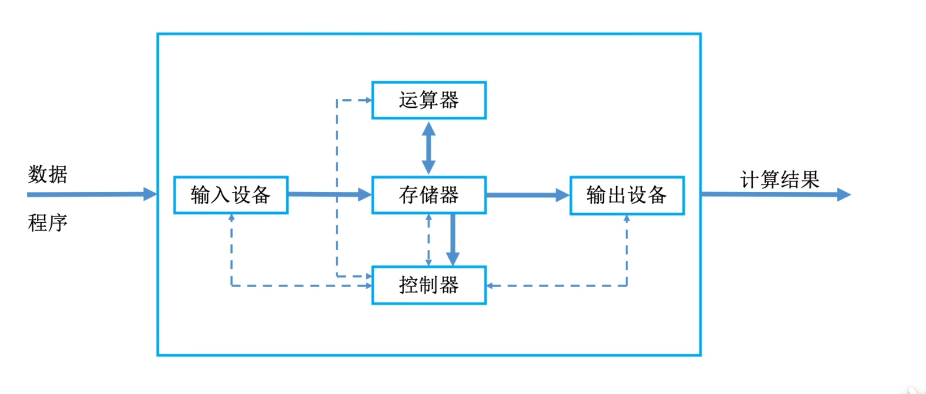
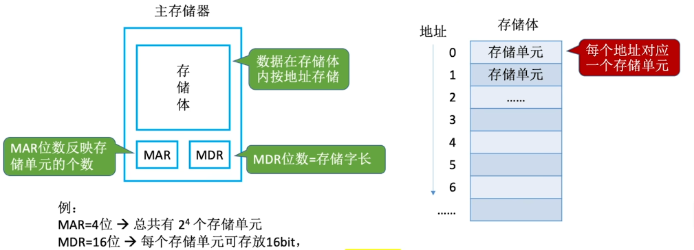
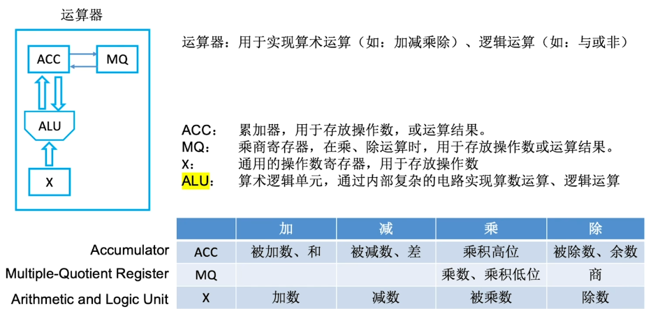

# 计算机系统概述

## 计算机发展历程

1. 计算机系统：硬件 + 软件

2. 硬件的发展

   + 电子管时代
   + 晶体管时代
   + 中小规模集成电路时代
   + 大规模，超大规模集成电路时代

   

3. 软件的发展离不开语言的发展(系统软件，应用软件)
   + 高级语言：fortean,pascal,c++,java

## 计算硬件的基本组成

1. 五大部分
   + 输入设备
   + 输出设备
   + 主存储器
   + 运算器：逻辑运算，算术运算
   + 控制器：指挥各部件，使程序运行
2. 早期冯诺伊曼机
   + “存储程序”的概念

3. 现代计算机的结构

   + CPU＝运算器 + 控制器

   

## 各个硬件的工作原理

1. 主存储器

   

   + 概念
     + 存储单元：每个存储单元存放一串二进制代码、
     + 存储字（word）：存储单元中二进制代码的组组合
     + 存储字长：存储单元中二进制代码的位数
     + 存储元：即存储二进制的电子元件，每个存储元可存1bit
   + MAR(Memory Address Register)：地址寄存器，用于指明要读/写哪个存储单元。其位数反映存储单元数的数量
   + MDR(Memory Data Register)：数据寄存器，用于暂存要读/写的数据。其位数=存储字长

2. 运算器

   

3. 控制器

   

4. 工作过程

